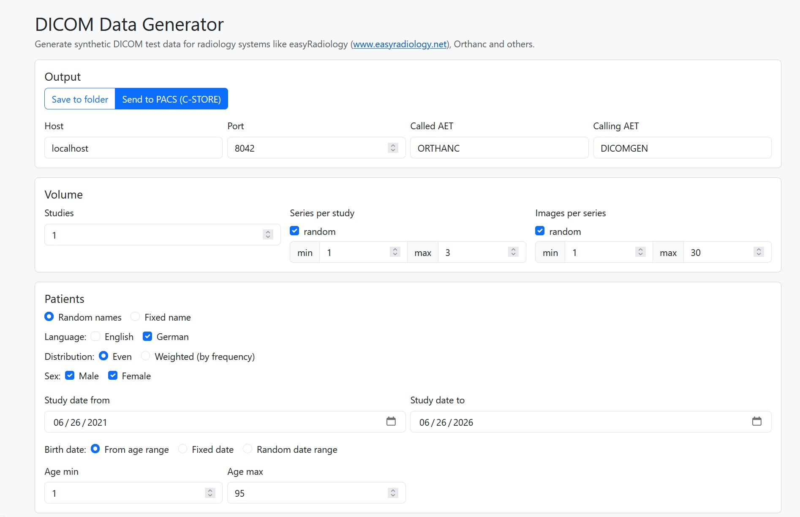

# DICOM Data Generator

A small, local **.NET 8 web app** that generates large amounts of **synthetic DICOM** test data —
to load-test [easy2BI](https://github.com/) and any PACS (e.g. Orthanc). Files carry realistic
patient names, modalities/machines, referring physicians and the same DICOM tags easy2BI pre-seeds,
but with **tiny pixel data** (default 8×8, 8-bit) so millions of instances stay small.

> ⚠️ **Synthetic data only.** Names, IDs and dates are randomly generated. Nothing here is real PHI.
> The tool binds to `localhost` and is meant to run on your own machine.



---

## Features

- Configure **studies → series → images** counts (fixed or random ranges).
- **Patient names** from bundled German + English first-name/surname lists (by sex), fixed or random,
  with an **even** or **frequency-weighted** distribution; first name always matches the chosen sex.
  Names are written in DICOM PN form (`Surname^FirstName`; physicians as `Surname^FirstName^^Dr.`).
- **Birth dates** from the age range (default), a fixed date, or a random range (defaults to the last
  ~90 years, never after the study date).
- **Modalities & machines:** pick from the full set of non-retired DICOM modality codes (or type your
  own), set how many machines each has (every machine gets a station name, serial number, manufacturer,
  model), and each modality writes its correct **SOP Class UID** (others fall back to Secondary Capture).
- **Organ site** (Body Part Examined): a fixed value, or random from a checkbox-selected pool of the
  official DICOM body-part Defined Terms (PS3.16 Annex L).
- **Transfer syntax:** a fixed value, or random from the supported uncompressed syntaxes (Implicit/
  Explicit VR Little Endian, Deflated Explicit VR Little Endian).
- **Site** (InstitutionName/Address) and **physicians**: referring (fixed, or a random pool of N "Dr."
  names matching the patient-name language); the reading physician is always different from the referrer.
- **Root UID** is configurable; study/series/instance UIDs are derived from it and validated (≤64 chars).
- **103 DICOM tags** in a foldable, per-level checklist (select-all/none); values are generated by
  category (dates, demographics, modality-tech, coded strings). A small identity set is always written
  so every file is valid.
- **Verify data:** optionally run fo-dicom's validator over every element while generating.
- **Output:** save to a **folder** (flat, or nested `Patient ▸ Study ▸ Series ▸ instance.dcm`) via a
  built-in server-side folder browser, **or** send straight to a **PACS via C-STORE**.
- Live progress, estimate, and cancel.

---

## Requirements

- [.NET SDK 8.0+](https://dotnet.microsoft.com/download) (the project targets `net8.0`; newer SDKs build it fine).

## Run (development)

```bash
git clone <this-repo>
cd dicomdatagenerator
dotnet run --project src/DicomDataGenerator
```

Then open <http://localhost:5300>. Swagger (API docs) is at <http://localhost:5300/swagger> in
Development.

## Test

```bash
dotnet test
```

---

## How to use

1. **Output** — choose *Save to folder* (pick a folder with **Browse…**, and a flat or nested layout)
   or *Send to PACS* (host/port/called-AET/calling-AET; defaults `localhost:4242 / ORTHANC / DICOMGEN`
   for an Orthanc dev PACS).
2. **Volume** — number of studies, and series-per-study / images-per-series (each can be a fixed
   number or a random min–max range).
3. **Patients** — random or fixed names; language (English/German); even vs. weighted distribution;
   sex (m/f); age and study-date ranges.
4. **Site & referrers** — institution name/address; fixed referrer or a random pool size.
5. **Modalities & machines** — tick the modalities (or add a custom one) and set machines per modality.
6. **Organ site** — fixed body part, or random from the selected pool.
7. **DICOM tags** — fold open Study/Series/Image and tick the tags to include.
8. **Advanced** — Root UID (prefixed before study/series/instance UIDs), pixel matrix size (or
   metadata-only), and a random **seed** (`0` = nondeterministic; any other value makes a run reproducible).
9. **Transfer syntax** — fixed, or random from the selected uncompressed syntaxes.
10. Click **Estimate** to preview counts, then **Generate** (tick **Verify data** to validate every
    element while generating). Watch the progress bar; **Cancel** anytime.

### Feeding the output into a PACS

- **PACS mode** stores directly via C-STORE while generating.
- **Folder mode** writes `.dcm` files you can import into a PACS (e.g. Orthanc's *Upload* page, or its
  import tools).

---

## Configuration

| Setting        | Default                      | Notes                                              |
|----------------|------------------------------|----------------------------------------------------|
| `Urls`         | `http://localhost:5300`      | Override the bind address (config or `--Urls`).    |
| `SeedDataPath` | auto (repo `seeddata/`)      | Folder holding the name lists + `dicom-tags.json`. |

`seeddata/` is resolved by walking up from the app's content root; override it with `SeedDataPath`
if you move it (e.g. for a published build).

---

## Distribute as a single executable

```bash
dotnet publish src/DicomDataGenerator -c Release -r win-x64 --self-contained -p:PublishSingleFile=true
```

This produces a standalone `DicomDataGenerator.exe` (no installed runtime required). Ship the
`seeddata/` folder alongside it (or set `SeedDataPath`); `wwwroot` is bundled into the executable.

---

## Project layout

```
src/DicomDataGenerator/
  Controllers/   FileSystem (folder browser), Seed (tags/modalities), Generation (estimate/start/status/cancel)
  Services/      SeedDataLoader, NameProvider, UidFactory, ModalityCatalog, ValuePools,
                 DicomFileBuilder, PacsSender, GenerationService
  Models/        request/status/config records
  wwwroot/       index.html + app.js (Vue 3 via CDN + Bootstrap 5, no build step)
tests/           xUnit tests (name parsing/weighting, UID validity, DICOM build round-trip)
seeddata/        name lists (de/en) + dicom-tags.json (the tag seed the UI renders)
```

DICOM files are built with [fo-dicom](https://github.com/fo-dicom/fo-dicom).

## License

MIT — see [LICENSE](LICENSE).

---

© Smart In Venture GmbH 2026
